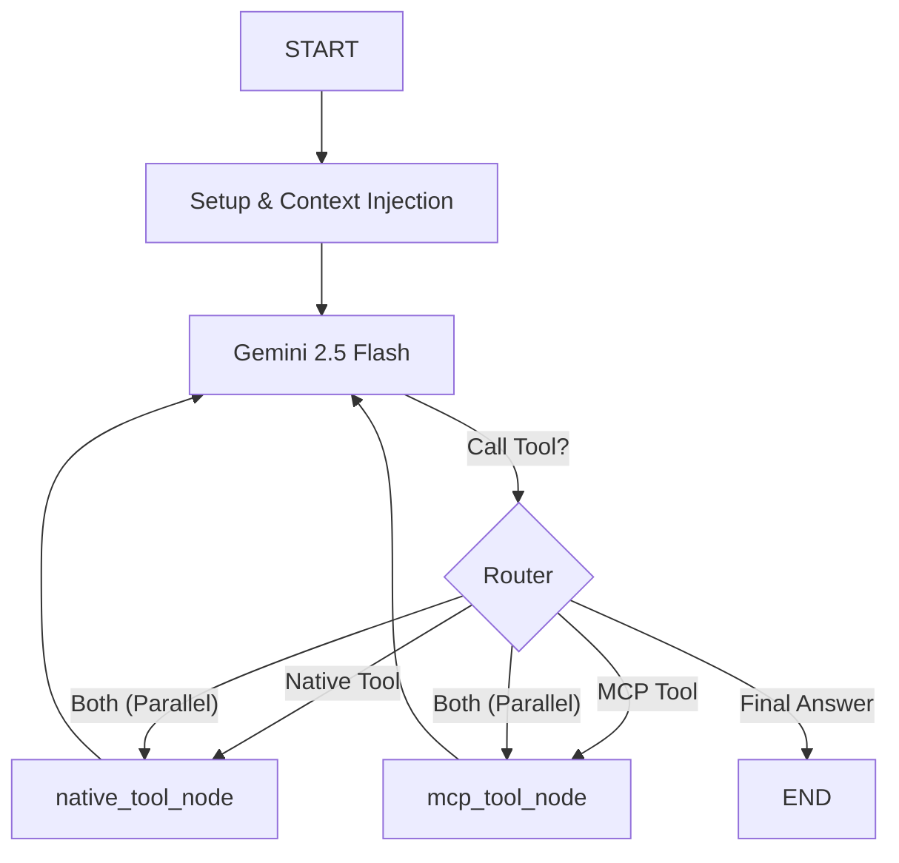

# 🧠 AgentX Backend

The advanced backend service for the  Agent X, built with **FastAPI**, **LangGraph**, and **LangChain**.
This system serves as an intelligent host that orchestrates interactions between the **Gemini 2.5 Flash** LLM and the **Model Context Protocol (MCP)** ecosystem.

## 🏗️ Architecture Overview

The backend follows a modular, state-of-the-art agentic architecture designed for stability, scalability, and robust tool use.

### 1. The Core: LangGraph Flow
At the heart of the system is the `chat_controller.py`, which manages a **LangGraph** workflow. Unlike simple chains, this graph supports cyclic execution and parallel tool calls.



*   **`setup_node`**: Prepares the state and injects System Prompts.
*   **`router`**: Determines if the LLM wants to call a Native tool, an MCP tool, or both simultaneously.
*   **`mcp_tool_node`**: Delegated execution of external MCP tools.
*   **`native_tool_node`**: Execution of internal Python tools (e.g., Google Drive, Time, Crypto).

### 2. MCP Integration Layer
The `MCPConnectionManager` (`utils/mcp_connection_manager.py`) acts as the bridge to the external world.
*   **Protocol**: Uses `http` transport for stability and `sse` logic for events.
*   **Discovery**: Uses `session.list_resources()` and `session.list_prompts()` to fetch clean metadata.
*   **Context Injection**:
    *   **"Menu"**: Injects available Resources (files/docs) and Prompts (templates) into the System Prompt.
    *   **"Power"**: Provides the `read_mcp_resource` Native Tool to allow the LLM to access the *content* of items listed in the "Menu".

### 3. Google Drive Integration
A first-class Native Tool implementation (`tools/google_drive/`).
*   **OAuth2**: Handles secure Token exchange and storage in MongoDB (`oauth_tokens` collection).
*   **Smart Injection**: Automatically injects `user_id` into tool calls, ensuring the LLM operates on the correct user's files without hallucinations.

## 🚀 Key Features

*   **⚡ Parallel Tool Execution**: Can list Google Drive folders and fetch MCP data in a single turn.
*   **🔐 Secure Auth**: standard JWT authentication + HTTP-only cookies.
*   **📂 Multi-User Capabilities**: Isolate workspaces and OAuth tokens per user.
*   **📝 Streaming Responses**: Full SSE (Server-Sent Events) support for real-time text and tool updates.
*   **🖼️ Multimodal Support**: Accepts images and text in a single request (Gemini Vision).

## 📂 Project Structure

```bash
backend/
├── controllers/
│   ├── chat_controller.py       # LangGraph Orchestrator
│   ├── mcp_server_controller.py # MCP Server CRUD & Testing
│   ├── google_oauth_controller.py # Drive Auth Flow
│   └── tool_controller.py       # Tool Metadata
├── graph/                       # LangGraph Components
│   ├── builder.py               # Graph Compilation
│   ├── nodes/                   # Execution Nodes
│   └── router.py                # Routing Logic
├── tools/                       # Native Tool Implementations
│   ├── google_drive/            # Drive API Tools
│   ├── utilities/               # Utility Tools (Time, Weather)
│   └── __init__.py              # Tool Registry
├── utils/
│   └── mcp_connection_manager.py # MCP Client & Session Mgmt
├── models/                      # Pydantic Database Models
├── routes/                      # API Endpoints
└── main.py                      # Application Entrypoint
```

## 🔌 API Reference

### Chat Streaming (`POST /chat/stream`)
**Description**: Use this for text-only chat with tool support.
**Payload (JSON)**:
```json
{
  "message": "List my files and tell me the weather",
  "conversation_id": "optional-uuid",
  "mcp_server_urls": ["https://my-server.com/mcp"],
  "model": "gemini-2.5-flash",
  "enabled_tools": ["google_drive", "utilities"]
}
```

### Multimodal Chat (`POST /chat/stream/multimodal`)
**Description**: Use this for uploading images + text.
**Payload (Multipart/Form-Data)**:
*   `message`: Text prompt
*   `images`: (Binary files)
*   `mcp_server_urls`: (JSON String) `["..."]`

### MCP Management
*   `GET /mcp-servers`: List connected servers.
*   `POST /mcp-servers/{id}/test`: Test connection and sync tools.

## 🛠️ Setup & Installation

1.  **Environment Variables** (`.env`):
    ```env
    MONGODB_URL=mongodb+srv://...
    GEMINI_API_KEY=AIzaSy...
    JWT_SECRET=your_secret
    CLOUDINARY_URL=...
    # Google OAuth (Optional)
    GOOGLE_CLIENT_ID=...
    GOOGLE_CLIENT_SECRET=...
    ```

2.  **Install Dependencies**:
    ```bash
    pip install -r requirements.txt
    ```

3.  **Run Server**:
    ```bash
    python main.py
    # Runs on http://localhost:8000
    ```

## 🧠 Technical Highlights for Reviewers

*   **Robustness**: Handles intermittent MCP connection failures gracefully.
*   **Security**: No credentials stored in plain text; Tokens encrypted (planned).
*   **Extensibility**: Adding a new tool is as simple as defining a Python function and registering it in `tools/__init__.py`.
*   **Observability**: Detailed console logs for Tool Calls, Resource Fetching, and Graph Routing.
