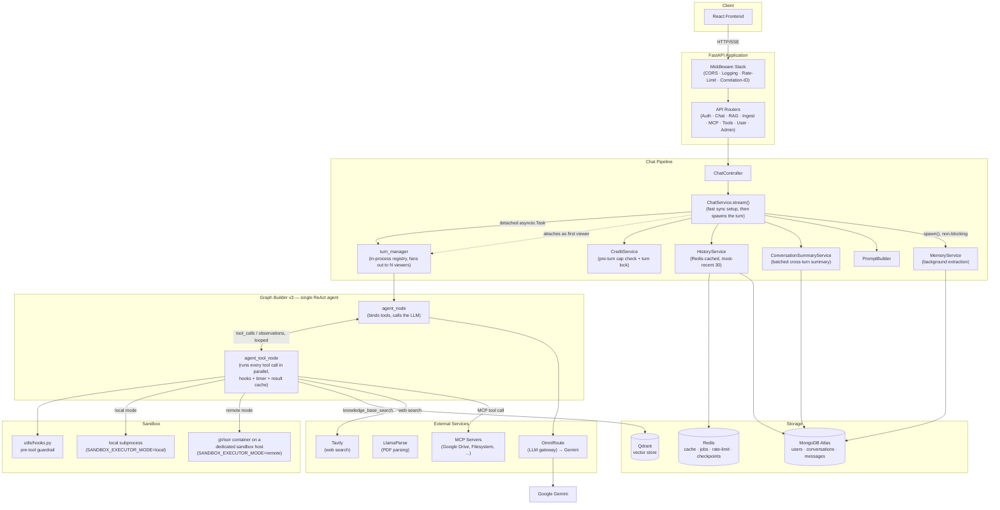
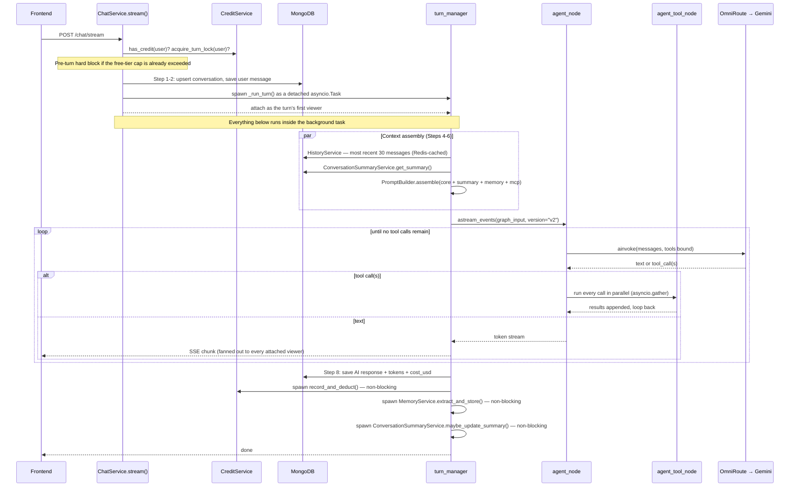

# AgentX Backend — Technical Documentation

> **Agentic AI Backend** | FastAPI · LangGraph · Google Gemini (via OmniRoute) · Qdrant · MongoDB · Redis · MCP
>
> Single ReAct agent with a real sandbox, on-demand skills, a free-tier credit system, and generation
> decoupled from the HTTP connection that started it.

---

## Table of Contents
1. [Project Overview](#1-project-overview)
2. [Architecture Overview](#2-architecture-overview)
3. [Directory Structure](#3-directory-structure)
4. [Application Startup & Lifecycle](#4-application-startup--lifecycle)
5. [API Routes Reference](#5-api-routes-reference)
6. [The Chat Pipeline (Agent Turn, Start to Finish)](#6-the-chat-pipeline-agent-turn-start-to-finish)
7. [Turn Lifecycle: Decoupled from the HTTP Request](#7-turn-lifecycle-decoupled-from-the-http-request)
8. [The Sandbox & Remote Execution](#8-the-sandbox--remote-execution)
9. [Security Guardrails (Centralized Hooks)](#9-security-guardrails-centralized-hooks)
10. [Free-Tier Credit System](#10-free-tier-credit-system)
11. [Context Engineering: Memory Bank + Cross-Turn Summarization](#11-context-engineering-memory-bank--cross-turn-summarization)
12. [Skills System](#12-skills-system)
13. [The Agentic RAG Pipeline](#13-the-agentic-rag-pipeline)
14. [Model Context Protocol (MCP) Integration](#14-model-context-protocol-mcp-integration)
15. [Redis: Caching, Rate-Limiting & Background Jobs](#15-redis-caching-rate-limiting--background-jobs)
16. [Authentication & Security](#16-authentication--security)
17. [Observability: LangSmith + Native Cost Analytics](#17-observability-langsmith--native-cost-analytics)
18. [Admin Analytics Dashboard](#18-admin-analytics-dashboard)
19. [Database Schema (MongoDB)](#19-database-schema-mongodb)
20. [Infrastructure & Deployment](#20-infrastructure--deployment)
21. [Environment Variables Reference](#21-environment-variables-reference)
22. [Running Locally & Testing](#22-running-locally--testing)

---

## 1. Project Overview

AgentX is an agentic AI workspace: a **single ReAct agent** (not a supervisor routing between subgraphs)
with its own Python sandbox, a shell, a skills library it loads on demand, document retrieval, optional
MCP tool connections, and a persistent memory of the user — given a task and left to actually do the work,
streaming every step back to the client as it happens.

Distinctive engineering choices covered in this document:
- **Generation isn't tied to the HTTP request that started it** — closing the tab doesn't stop the agent (§7)
- **Code execution runs on a separate, gVisor-sandboxed host**, not as a subprocess in the app container, fail-closed if unreachable (§8)
- **Security and cost are enforced centrally**, not copy-pasted per tool (§9, §10)
- **Context is compacted, not truncated** — a long conversation's older messages are summarized, not dropped (§11)
- **Two purpose-built EC2 boxes and a tests-gate-every-deploy CI/CD pipeline**, not a container orchestration platform (§20)

---

## 2. Architecture Overview


```mermaid
graph TD
    subgraph client [Client]
        FE["React Frontend"]
    end

    subgraph fastapi_app [FastAPI Application]
        MW["Middleware Stack\n(CORS · Logging · Rate-Limit · Correlation-ID)"]
        ROUTES["API Routers\n(Auth · Chat · RAG · Ingest · MCP · Tools · User · Admin)"]
    end

    subgraph chat_pipeline [Chat Pipeline]
        CC["ChatController"]
        CS["ChatService.stream()\n(fast sync setup, then spawns the turn)"]
        TM["turn_manager\n(in-process registry, fans out to N viewers)"]
        HS["HistoryService\n(Redis-cached, most-recent 30)"]
        CSS["ConversationSummaryService\n(batched cross-turn summary)"]
        PB["PromptBuilder"]
        CRED["CreditService\n(pre-turn cap check + turn lock)"]
        MS["MemoryService\n(background extraction)"]
    end

    subgraph graph_v3 [Graph Builder v3 — single ReAct agent]
        AN["agent_node\n(binds tools, calls the LLM)"]
        ATN["agent_tool_node\n(runs every tool call in parallel,\nhooks + timer + result cache)"]
    end

    subgraph sandbox [Sandbox]
        HOOKS["utils/hooks.py\npre-tool guardrail"]
        LOCAL["local subprocess\n(SANDBOX_EXECUTOR_MODE=local)"]
        REMOTE["gVisor container on a\ndedicated sandbox host\n(SANDBOX_EXECUTOR_MODE=remote)"]
    end

    subgraph storage [Storage]
        MONGO[("MongoDB Atlas\nusers · conversations · messages")]
        QDRANT[("Qdrant\nvector store")]
        REDIS[("Redis\ncache · jobs · rate-limit · checkpoints")]
    end

    subgraph external [External Services]
        OMNI["OmniRoute\n(LLM gateway) → Gemini"]
        LLAMA["LlamaParse\n(PDF parsing)"]
        TAVILY["Tavily\n(web search)"]
        MCP_SERVER["MCP Servers\n(Google Drive, Filesystem, ...)"]
    end

    FE -->|"HTTP/SSE"| MW --> ROUTES --> CC --> CS
    CS -->|"detached asyncio.Task"| TM
    TM --> AN
    CS -.->|"attaches as first viewer"| TM
    CS --> CRED
    CS --> HS --> REDIS
    CS --> CSS --> MONGO
    CS --> PB
    AN <-->|"tool_calls / observations, looped"| ATN
    ATN --> HOOKS
    ATN -->|local mode| LOCAL
    ATN -->|remote mode| REMOTE
    AN --> OMNI --> GEMINI["Google Gemini"]
    ATN -->|"knowledge_base_search"| QDRANT
    ATN -->|"web search"| TAVILY
    ATN -->|"MCP tool call"| MCP_SERVER
    CS -->|"spawn(), non-blocking"| MS --> MONGO
    HS --> MONGO
```

This is **"Graph Builder v3"** — it replaced an earlier supervisor-plus-7-subgraphs design that routed
between specialized graphs via an intent classifier. The current graph (`graph/builder.py`) compiles to
just two nodes: `agent_node` → (conditional) → `agent_tool_node` → back to `agent_node` → `END`.
`agent_node` assembles one flat tool list every turn — always-on sandbox tools, skill discovery, the
user's enabled native tools, and live MCP tools — and binds them to Gemini. `agent_tool_node` rebuilds
the identical tool map to execute the calls in parallel via `asyncio.gather`.

---

## 3. Directory Structure

```text
backend/
├── main.py                        # FastAPI app, middleware stack, lifespan
│
├── routes/                        # Thin HTTP layer — delegates to controllers
│   ├── auth_routes.py             # /auth/signup, /login, /logout, /me
│   ├── chat_routes.py             # /chat/stream, /stream/multimodal,
│   │                               #   /{id}/active-turn, /{id}/resume, /{id}/stop
│   ├── conversation_routes.py     # /conversations CRUD
│   ├── upload_routes.py           # /api/v1/ingest/upload, /job/{id}, /jobs
│   ├── rag_routes.py              # /api/v1/rag/chat, /retrieve, /files
│   ├── mcp_server_routes.py       # /api/mcp/servers CRUD
│   ├── tool_routes.py             # /api/tools, toggle per-user native tools
│   ├── skill_vault_routes.py      # user-uploaded skills CRUD
│   ├── user_routes.py             # memories, credits (/api/users/credits)
│   ├── admin_routes.py            # cost analytics, admin-only
│   ├── oauth_routes.py            # Google Drive OAuth + generic MCP OAuth 2.1 callback
│   ├── parser_routes.py           # proxies to the standalone PDF parser microservice
│   ├── output_routes.py           # serves sandbox-generated files back to the client
│   └── agent_routes.py            # misc agent introspection endpoints
│
├── controllers/                   # Request parsing + delegation to services
│   ├── chat_controller.py
│   ├── user_controller.py
│   └── google_oauth_controller.py
│
├── services/                      # Business logic
│   ├── chat_service.py            # ChatService.stream() — the orchestrator (see §6)
│   ├── turn_manager.py            # detached-task registry, fans out to N viewers (see §7)
│   ├── history_service.py         # Redis-cached, most-recent-30 conversation history
│   ├── conversation_summary_service.py  # cross-turn compaction (see §11)
│   ├── prompt_builder.py          # assembles the full system prompt from all sections
│   ├── memory_service.py          # durable user-fact extraction (see §11)
│   ├── credit_service.py          # free-tier cap + turn concurrency lock (see §10)
│   ├── langsmith_service.py       # attaches real cost onto the LangSmith trace
│   ├── ingestion_job_service.py   # Redis-backed job queue for document ingestion
│   └── universal_file_reader.py   # native multimodal file reading for sandbox_read_file_natively
│
├── graph/                         # LangGraph — Graph Builder v3 (see §2)
│   ├── builder.py                 # compiles the 2-node StateGraph
│   ├── llm_registry.py            # singleton cache of LLM client instances
│   └── nodes/
│       ├── common.py               # AgentState TypedDict
│       ├── agent_node.py           # assembles tools, binds to the LLM, invokes
│       └── agent_tool_node.py      # executes every tool call in parallel
│
├── rag/                            # Agentic RAG (see §13)
│   ├── ingestion_service.py
│   ├── graph/workflow.py           # Qdrant + Tavily in parallel, grade, agent, verify
│   ├── parsers/llama_parse_client.py
│   ├── chunking/splitter_factory.py
│   └── vector_store/qdrant_manager.py
│
├── skills/                         # Progressive-disclosure skills system (see §12)
│   ├── skill_loader.py
│   └── builtin/<name>/SKILL.md     # markdown manuals, YAML frontmatter
│
├── tools/
│   ├── __init__.py                 # AVAILABLE_TOOLS registry
│   └── utilities/
│       ├── run_python.py           # sandbox_run_python
│       ├── run_shell.py            # sandbox_run_shell
│       ├── edit_file.py            # sandbox_edit_file
│       ├── analyze_image.py        # sandbox_analyze_image
│       ├── read_file_natively.py   # sandbox_read_file_natively
│       └── ...                     # web search, weather, dice, MCP resource reads
│
├── core/                           # Cross-cutting infrastructure
│   ├── database.py                 # Motor (async MongoDB) client + collections
│   ├── auth.py                     # JWT encode/decode, bcrypt
│   ├── middleware.py                # get_current_user dependency
│   ├── cache.py                     # async Redis pool, in-memory fallback
│   ├── limiter.py                   # slowapi rate limiting
│   └── logging_config.py            # structlog JSON processor chain
│
├── utils/
│   ├── hooks.py                     # centralized pre/post-tool guardrail hooks (see §9)
│   ├── sandbox_client.py            # gVisor remote-execution client (see §8)
│   ├── mcp_connection_manager.py    # MCP server connections, 5-min tool cache
│   └── workspace.py                 # per-user, per-conversation sandbox path resolution
│
└── models/                          # Pydantic schemas
```

---

## 4. Application Startup & Lifecycle

```mermaid
sequenceDiagram
    participant U as Uvicorn
    participant APP as FastAPI Lifespan
    participant REDIS as Redis
    participant MONGO as MongoDB
    participant AGENT as Agent Graph

    U->>APP: startup
    APP->>REDIS: init_redis() — connect pool, ping
    Note over REDIS: Non-fatal — falls back to in-memory if unreachable
    APP->>MONGO: ensure_indexes()
    APP->>MONGO: register native tools (tools_collection)
    APP->>AGENT: warm up the compiled graph
    APP-->>U: yield (LIVE)
    Note over U: Handles traffic; a background loop reaps idle sandbox workspaces
    U->>APP: shutdown
    APP->>APP: mcp_manager.disconnect_all()
    APP->>APP: close the checkpointer
    APP->>REDIS: close_redis()
```

Checkpointing is Redis-backed (`langgraph-checkpoint-redis`) when `REDIS_URL` is set, else an in-memory
`MemorySaver` — the app runs fully without Redis, only distributed features degrade.

---

## 5. API Routes Reference

| Method | Path | Auth | Description |
|--------|------|------|-------------|
| GET | `/health` | ❌ | Deep health check (MongoDB, Redis, Qdrant) |
| POST | `/auth/signup` / `/login` / `/logout` | ❌ | JWT cookie auth |
| GET | `/auth/me` | ✅ | Current user, includes `is_admin` |
| POST | `/chat/stream` | ✅ | Main SSE endpoint — spawns a detached turn (§7) |
| POST | `/chat/stream/multimodal` | ✅ | Same, with file/image attachments |
| GET | `/chat/{id}/active-turn` | ✅ | Cheap check: is a turn currently running? |
| GET | `/chat/{id}/resume` | ✅ | Attach as a new viewer to an in-flight or just-finished turn |
| POST | `/chat/{id}/stop` | ✅ | Actually cancels the background task |
| GET/DELETE | `/conversations` | ✅ | Conversation CRUD |
| POST | `/api/v1/ingest/upload` | ✅ | Upload a document — returns a `job_id` immediately |
| GET | `/api/v1/ingest/job/{id}` / `/jobs` | ✅ | Poll one job, or list this user's recent jobs |
| POST | `/api/v1/rag/chat` | ✅ | Agentic RAG chat |
| GET | `/api/v1/rag/files` | ✅ | List ingested files |
| GET/POST/DELETE | `/api/mcp/servers` | ✅ | MCP server registration |
| GET/PUT | `/api/tools` | ✅ | List / toggle native tools |
| GET/DELETE | `/api/users/memories` | ✅ | Memory bank |
| GET | `/api/users/credits` | ✅ | Current user's own spend vs. free-tier cap |
| GET | `/oauth/google/authorize` / `/callback` | ✅ / ❌ | Google Drive OAuth |
| GET | `/oauth/mcp/callback` | ❌ | Generic MCP server OAuth 2.1 callback |

### Admin routes (`is_admin: true` required, else HTTP 403)

| Method | Path | Description |
|---|---|---|
| GET | `/admin/overview` | Platform-wide totals: users, messages, tokens, cost |
| GET | `/admin/users` | Per-user token & cost aggregates |
| GET | `/admin/users/{id}/sessions` | Per-session cost for one user |
| GET | `/admin/users/{id}/sessions/{conv_id}` | Turn-by-turn token/cost detail |
| GET | `/admin/usage/daily` / `/usage/models` / `/usage/tools` | Time-series and breakdown analytics |

---

## 6. The Chat Pipeline (Agent Turn, Start to Finish)

`ChatService.stream()` does fast synchronous setup, then hands the actual work off to a detached
background task (see §7) — it does **not** drive the agent inline with the HTTP response.


```mermaid
sequenceDiagram
    participant FE as Frontend
    participant CS as ChatService.stream()
    participant CRED as CreditService
    participant MONGO as MongoDB
    participant TM as turn_manager
    participant AN as agent_node
    participant ATN as agent_tool_node
    participant OMNI as OmniRoute → Gemini

    FE->>CS: POST /chat/stream
    CS->>CRED: has_credit(user)? acquire_turn_lock(user)?
    Note over CS: Pre-turn hard block if the free-tier cap is already exceeded
    CS->>MONGO: Step 1-2: upsert conversation, save user message
    CS->>TM: spawn _run_turn() as a detached asyncio.Task
    CS-->>TM: attach as the turn's first viewer
    Note over CS,TM: Everything below runs inside the background task

    par Context assembly (Steps 4-6)
        TM->>MONGO: HistoryService — most recent 30 messages (Redis-cached)
        TM->>MONGO: ConversationSummaryService.get_summary()
        TM->>TM: PromptBuilder.assemble(core + summary + memory + mcp)
    end

    TM->>AN: astream_events(graph_input, version="v2")
    loop until no tool calls remain
        AN->>OMNI: ainvoke(messages, tools bound)
        OMNI-->>AN: text or tool_call(s)
        alt tool call(s)
            AN->>ATN: run every call in parallel (asyncio.gather)
            ATN-->>AN: results appended, loop back
        else text
            AN-->>TM: token stream
            TM-->>FE: SSE chunk (fanned out to every attached viewer)
        end
    end

    TM->>MONGO: Step 8: save AI response + tokens + cost_usd
    TM->>CRED: spawn record_and_deduct() — non-blocking
    TM->>TM: spawn MemoryService.extract_and_store() — non-blocking
    TM->>TM: spawn ConversationSummaryService.maybe_update_summary() — non-blocking
    TM-->>FE: done
```

### SSE Event Format

| Event | Meaning |
|-------|---------|
| `chunk` | A token of the response |
| `status` | e.g. "Using tool: sandbox_run_python" |
| `tool_call` / `tool_output` | Invocation details / result |
| `stopped` | The turn was cancelled (via `/stop` or the credit grace cutoff) |
| `done` | Stream complete |
| `error` | Includes `error_code` for specific cases (e.g. `credit_limit_reached`) |

---

## 7. Turn Lifecycle: Decoupled from the HTTP Request

A closed tab or a page refresh does **not** stop the agent. `ChatService.stream()` spawns `_run_turn()`
as a **detached `asyncio.Task`** and attaches its own SSE response as that task's first "viewer" —
`services/turn_manager.py` is an in-process registry that fans a running turn's events out to any
number of subscriber queues, and replays everything already published to a viewer that attaches late.

- **`GET /chat/{id}/resume`** — attaches a new viewer (page reload, a second tab): replays every event
  published so far, then continues streaming live. This is the same mechanism used for the original
  request; there's no special "resume" code path in the agent itself.
- **`GET /chat/{id}/active-turn`** — a cheap check the frontend calls before deciding whether to resume.
- **`POST /chat/{id}/stop`** — actually cancels the background task. The old "abort the fetch to stop
  generation" trick no longer reaches the agent, since generation isn't tied to any one request.

This is single-process/in-memory by design, matching the current single-container deployment — if the
server process itself dies, the turn dies with it, same as any in-flight request would.

---

## 8. The Sandbox & Remote Execution

Every user gets a persistent workspace under `WORKSPACE_ROOT` with a lazily-created Python venv, shared
across their conversations. `uploads/`, `outputs/`, and `work/` are scoped **one level deeper, per
conversation** — `is_path_within_conversation_sandbox()` guards against escaping the sandbox root,
including escaping into a *different* conversation's folder for the same user. This isolation is
load-bearing, not cosmetic: file-creation detection works by snapshotting `outputs/` before a turn and
diffing mtimes after, and a shared-per-user (not per-conversation) directory let one conversation's file
write land inside a *different, concurrent* conversation's snapshot window — confirmed live before the fix.

### Execution mode

`SANDBOX_EXECUTOR_MODE` controls where code actually runs:

- **`local`** (default) — `sandbox_run_python`/`sandbox_run_shell` execute as a subprocess in the app's
  own container, under a dedicated non-root UID with `--cap-drop=ALL` and only `SETUID`/`SETGID`/
  `CHOWN`/`DAC_OVERRIDE` added back.
- **`remote`** — code is streamed to a **separate, network-isolated host** and executed inside a
  **gVisor container** per execution (`utils/sandbox_client.py`). This is genuinely a different machine,
  not just a different process — kernel-level isolation, not a subprocess boundary. **Fail-closed by
  design**: if the sandbox host is unreachable, the tool call returns an explicit error; it never
  silently falls back to running the code locally.

---

## 9. Security Guardrails (Centralized Hooks)

`utils/hooks.py` is a single, centralized pre-tool guardrail — every sandbox tool call passes through it
before executing, instead of each tool re-implementing its own checks:

- **`check_sandbox_path()`** — resolves the target path against the calling conversation's sandbox root
  and rejects anything that tries to climb out (`sandbox_run_python`, `sandbox_edit_file`,
  `sandbox_analyze_image`).
- **`check_run_shell_command()`** — rejects destructive shell patterns (`rm -rf /`, fork bombs, disk
  wipes) before the shell ever sees them.
- Registered as a `pre_tool_hook` that `agent_tool_node.py` runs ahead of every tool execution, with
  `conversation_id` threaded through so path checks are scoped correctly.

Every tool call is also wrapped in a `ToolTimer` and passes through a result cache
(`utils/tool_result_cache.py`) to avoid redundant work within a turn.

---

## 10. Free-Tier Credit System

`services/credit_service.py` tracks real per-turn spend (computed from actual token counts, not
estimates) against a per-user free-tier cap.

- **Cap**: `credit_cap_usd` on the user document, defaulting to `DEFAULT_CREDIT_CAP_USD` ($5.00) if
  absent — deliberately per-user so a future paid tier can just raise it on that one account.
- **Grace buffer**: `CREDIT_GRACE_USD` ($1.00) — a turn already in flight is allowed to finish into the
  grace zone rather than being cut off mid-answer; it's the *next* turn that actually gets blocked.
- **Pre-turn hard block**: `has_credit()` is checked before a turn is allowed to start; if exceeded, the
  client gets an SSE `error` event with `error_code: "credit_limit_reached"` and no turn is created.
- **Mid-turn cutoff**: inside the token-accumulation loop, running spend is checked against
  `cap + GRACE` on every LLM call; if crossed, the task is cancelled (reusing the same
  `asyncio.CancelledError` handling that already persists partial content and emits a `stopped` event).
- **Concurrency guard**: `acquire_turn_lock()` (Redis `SET NX`) allows only one in-flight turn per user,
  closing a race where several parallel turns could each pass `has_credit()` before any of them deducts.
- **Admins are exempt from enforcement but not accounting** — `has_credit()` always returns `True` for
  `is_admin` users, and the mid-turn cutoff is skipped for them too, but `record_and_deduct()` still runs
  identically, so spend is tracked for every account regardless.
- **Deduction**: `record_and_deduct()` runs as a non-blocking background task after a turn completes
  (including a stopped one), retried a few times against MongoDB `$inc` since losing this write would
  silently undercharge a completed turn.

Real pricing lives in `config/model_config.py` — the default model
(`antigravity/gemini-3.5-flash-medium`, served through OmniRoute) is priced at `$1.50` / `$9.00` per 1M
input/output tokens.

---

## 11. Context Engineering: Memory Bank + Cross-Turn Summarization

Two complementary systems keep the agent's context both personalized and complete, without letting the
prompt grow unbounded.

### Memory Bank (`services/memory_service.py`)

After each turn, a background task extracts durable facts — name, stack, projects, preferences — and
merges them into the user's `user_memories` document. `PromptBuilder` folds the latest ~10 back into the
system prompt at the start of every turn, so a brand-new conversation already knows who it's talking to.

### Cross-turn summarization (`services/conversation_summary_service.py`)

`HistoryService` only ever sends the model the most recent 30 messages — correct (a fixed 2026-08-09
bug used to return the *oldest* 30 instead), but not unlimited. What ages out of that window isn't
simply dropped:

- Every time a full **batch of 10** newly-aged-out messages accumulates, they're folded into a running,
  **300-word-capped** summary via a background LLM call — batched deliberately, so a long conversation
  pays for one compact summarization call per ~10 messages, not one per turn.
- The summary is injected into the system prompt as its own section ("Earlier in this conversation —
  summarized"), separate from the raw recent-30 window.
- This directly follows Anthropic's published context-engineering guidance: prefer **compaction** over
  hard truncation, so what falls out of the raw window is remembered as a summary rather than forgotten
  outright.

---

## 12. Skills System

Markdown manuals (YAML frontmatter + body) the agent discovers and loads on demand — mirrors Anthropic's
Claude Skills model, so the system prompt stays small and behavior stays specific.

- **Level 1 (cheap)**: `list_skills()` returns only name + description for every built-in
  (`skills/builtin/<name>/SKILL.md`) and user-uploaded (MongoDB `user_skills_collection`) skill.
- **Level 2 (full body)**: `load_skill(name)` fetches the complete manual, only when the agent decides a
  task needs it.
- `get_relevant_skill_for_message()` does trigger-word matching for auto-suggestion.

---

## 13. The Agentic RAG Pipeline

A separate, self-contained LangGraph workflow (`rag/graph/workflow.py`) for document-grounded Q&A —
Qdrant vector search and Tavily web search run **in parallel** (`asyncio.gather(..., return_exceptions=True)`)
so one failing source never sinks retrieval, followed by relevance grading, an agentic answer loop that
can call `search_knowledge_base` again if needed, and a groundedness check before returning.

Ingestion is asynchronous: `POST /api/v1/ingest/upload` returns a `job_id` immediately;
`IngestionJobService` tracks state in Redis (24h TTL) while a background task parses (LlamaParse, tables
and images preserved), chunks, embeds, and upserts into Qdrant. The frontend polls `GET /job/{id}` or
`GET /jobs` for a persistent "what's happening with my uploads" view.

---

## 14. Model Context Protocol (MCP) Integration

`utils/mcp_connection_manager.py` is a singleton managing connections to external MCP servers over
**stdio**, **SSE**, or **Streamable HTTP**. Tool discovery is cached with a **5-minute TTL** per server
so the agent doesn't pay a network round-trip on every turn. Auth is either **OAuth 2.1** (automatic
authorization-server discovery + PKCE) or a plain API-key header, and every connection is isolated per
user. Discovered tools are converted to LangChain `StructuredTool` objects and land in `agent_node`'s
flat tool list the same turn they're connected — no redeploy required.

---

## 15. Redis: Caching, Rate-Limiting & Background Jobs

| Use | Detail |
|---|---|
| Conversation history cache | Key `history:{conversation_id}:{user_id}`, 5-min TTL, invalidated after every turn |
| LangGraph checkpointing | `langgraph-checkpoint-redis` when `REDIS_URL` is set, else in-memory `MemorySaver` |
| Rate limiting | `slowapi`, Redis-backed with in-memory fallback |
| Ingestion job state | JSON, 24h TTL |
| Credit spend cache | Read-through cache over the Mongo source of truth, 1h TTL |
| Turn concurrency lock | `SET NX`, self-healing TTL as a safety net if a process dies mid-turn |

**Graceful degradation**: if Redis is unreachable, `core/cache.py` falls back to an in-memory dict and
`core/limiter.py` falls back to `slowapi`'s in-memory backend — the app starts and works fully; only
multi-instance features degrade.

---

## 16. Authentication & Security

JWT (`HS256`) in an `HttpOnly` cookie — `secure=True` + `samesite="none"` in production,
`secure=False` + `samesite="lax"` in development, controlled by `ENVIRONMENT`. Passwords hashed with
`bcrypt`. `get_current_user` reads the cookie first, falling back to an `Authorization: Bearer` header.

---

## 17. Observability: LangSmith + Native Cost Analytics

Two layers, running simultaneously:

- **LangSmith** (`LANGCHAIN_TRACING_V2=true`) — full trace, visual graph, latency per node. The turn's
  `run_id` is set explicitly to the same UUID already used for `turn_manager` tracking, so
  `services/langsmith_service.py` can attach the real computed `cost_usd`/token counts onto the
  corresponding trace after the fact (retried a few times, since LangSmith's ingestion is async and can
  race the attach call).
- **Native tracking** (the source of truth) — `astream_events(version="v2")`, filtered on
  `on_chat_model_end` with `metadata.langgraph_node` populated, so token counts aren't double-counted
  across tool-call loops. Stored permanently on the message document and fed into both the admin
  dashboard and the credit system.

---

## 18. Admin Analytics Dashboard

`/admin/*` routes require `is_admin: true` on the user document (`403` otherwise — set the flag
directly in MongoDB). Drill-down hierarchy:

```
/admin  →  /admin/users  →  /admin/users/{id}/sessions  →  /admin/users/{id}/sessions/{conv_id}
overview   per-user cost    per-session cost for one user   turn-by-turn token/cost detail
```

---

## 19. Database Schema (MongoDB)

### `users`
```json
{
  "_id": "ObjectId", "email": "...", "name": "...", "password": "bcrypt hash",
  "is_admin": false,
  "credits_used_usd": 0.42, "credit_cap_usd": 5.0
}
```

### `conversations`
```json
{
  "_id": "ObjectId", "user_id": "...", "title": "...",
  "context_summary": "running cross-turn summary text",
  "summary_covers_count": 40,
  "updated_at": "ISODate"
}
```

### `messages`
```json
{
  "_id": "ObjectId", "conversation_id": "...", "user_id": "...",
  "role": "user | model", "content": "...", "tool_steps": [...],
  "model": "antigravity/gemini-3.5-flash-medium",
  "input_tokens": 523, "output_tokens": 148, "cost_usd": 0.00527,
  "timestamp": "ISODate"
}
```

### `user_memories`
```json
{ "_id": "ObjectId", "user_id": "...", "memories": [{"topic": "...", "content": "..."}] }
```

---

## 20. Infrastructure & Deployment

No orchestration platform — two purpose-built EC2 boxes and a managed data layer.

| Component | Where |
|---|---|
| Backend | AWS EC2 (Amazon Linux 2023), Docker container `chatbot-backend`, nginx + Let's Encrypt at `agentx-api.ankitrajai.in` |
| LLM gateway, PDF parser, sandbox host | A **second** EC2 box: OmniRoute (Node LLM gateway → Gemini) + a custom PDF parser microservice + the gVisor Sandbox Execution Service (`sandbox-service.service`) — all behind nginx with a shared API-key gate. Never exposed directly to the public internet; only reachable from the backend box. |
| Frontend | Vercel — auto-deploys on push to `main` |
| Data layer | MongoDB Atlas, Qdrant, Redis, Cloudinary — all managed, nothing stateful on the app box itself |

### CI/CD (GitHub Actions)

1. **`Backend tests`** — push/PR to `main` or manual dispatch: full `pytest` suite.
2. **`Deploy backend`** — triggered via `workflow_run` only after tests pass: rsyncs the repo to a fresh
   versioned directory on the box, carries the gitignored `.env` forward from the previous deploy,
   `docker build`s a new image, stops and renames the old container (kept for rollback, not deleted),
   starts the new one, then health-checks it — **automatically rolling back to the previous container
   on failure**.

Every previous deployed container is kept, stopped, for instant rollback.

---

## 21. Environment Variables Reference

| Variable | Required | Description |
|----------|----------|-------------|
| `MONGO_URI` | ✅ | MongoDB Atlas connection string |
| `JWT_SECRET_KEY` | ✅ | Secret for signing JWTs |
| `OMNIROUTE_BASE_URL` / `OMNIROUTE_API_KEY` | ✅ | LLM gateway in front of Gemini |
| `QDRANT_URL` / `QDRANT_API_KEY` / `QDRANT_COLLECTION` | ✅ | Vector store |
| `LLAMA_CLOUD_API_KEY` | ✅ | LlamaParse for document ingestion |
| `REDIS_URL` | ⚠️ Optional | Degrades gracefully to in-memory if absent |
| `SANDBOX_EXECUTOR_MODE` | ⚠️ Optional | `local` (default) or `remote` (gVisor host) |
| `SANDBOX_SERVICE_URL` / `SANDBOX_SERVICE_TOKEN` | Required if `remote` | The dedicated sandbox host |
| `WORKSPACE_ROOT` | ⚠️ Optional | Per-user sandbox root (default `~/agentx_workspace`) |
| `DEFAULT_CREDIT_CAP_USD` | ⚠️ Optional | Free-tier cap per user (default `5.0`) |
| `CREDIT_GRACE_USD` | ⚠️ Optional | Mid-turn grace buffer past the cap (default `1.0`) |
| `TAVILY_API_KEY` | ⚠️ Optional | Web search — skipped if missing |
| `CLOUDINARY_CLOUD_NAME` / `_API_KEY` / `_API_SECRET` | ⚠️ Optional | Image/attachment storage |
| `CLIENT_ID` / `CLIENT_SECRET` | ⚠️ Optional | Google Drive OAuth |
| `LANGCHAIN_TRACING_V2` / `_API_KEY` / `_PROJECT` | ⚠️ Optional | LangSmith tracing |
| `ENVIRONMENT` | ⚠️ Optional | `production` enables secure cookies |
| `ALLOWED_ORIGINS` / `BACKEND_URL` / `FRONTEND_URL` | ⚠️ Optional | CORS + OAuth redirect targets |
| `CHAT_RATE_LIMIT` / `UPLOAD_RATE_LIMIT` | ⚠️ Optional | Per-minute limits (default `20` / `5`) |

See `.env.sample` for the complete, currently-accurate list — it is the source of truth, not this table.

---

## 22. Running Locally & Testing

```bash
cd backend
python -m venv venv
venv\Scripts\activate            # Windows / source venv/bin/activate on Mac/Linux

pip install -r requirements.txt
cp .env.sample .env              # fill in your keys

uvicorn main:app --reload --port 8000
```

```bash
curl http://localhost:8000/health
```

### Test suite (pytest-asyncio, auto mode)

```bash
pytest                                              # full suite
pytest tests/test_credit_service.py                 # a single file
pytest tests/test_agent_v3.py::TestClass::test_name -v
```

`tests/test_integration_live.py` hits real external services (Gemini, Qdrant, etc.) — it needs live API
keys/network, and its failures shouldn't be treated the same as a unit test regression. The same suite
runs automatically in CI on every push/PR to `main` (see §20).

Interactive API docs: `http://localhost:8000/docs`
