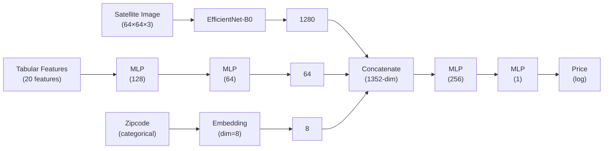

<!-- Page 1 -->


# Satellite Imagery-Based Property Valuation Using Multimodal Deep Learning

Your Name
Your Institution

January 3, 2026

## Contents

**1 Overview: Approach and Modeling Strategy 3**
1.1 Problem Statement . . . . . . . . . . . . . . . . . . . . . . . . . . . . . . 3
1.2 Modeling Strategy: The Hybrid Architecture . . . . . . . . . . . . . . . . 3
1.3 Rationale for the Hybrid Approach . . . . . . . . . . . . . . . . . . . . . 3

**2 Exploratory Data Analysis and Preprocessing 4**
2.1 Data Cleaning . . . . . . . . . . . . . . . . . . . . . . . . . . . . . . . . . 4
2.2 Feature Engineering . . . . . . . . . . . . . . . . . . . . . . . . . . . . . 4
2.3 Price Distribution Analysis . . . . . . . . . . . . . . . . . . . . . . . . . 5
2.4 Correlation Analysis . . . . . . . . . . . . . . . . . . . . . . . . . . . . 6
2.5 Feature-Price Relationships . . . . . . . . . . . . . . . . . . . . . . . . 7
2.6 Geospatial Analysis . . . . . . . . . . . . . . . . . . . . . . . . . . . . . 8
2.7 Satellite Imagery Analysis . . . . . . . . . . . . . . . . . . . . . . . . . 9

**3 Financial and Visual Insights 10**
3.1 Visual Explainability Using Grad-CAM . . . . . . . . . . . . . . . . . . . 10
3.2 Dual-Mode Attention: Context vs. Structure . . . . . . . . . . . . . . . . 11
3.3 Built Infrastructure vs. Vegetation Influence . . . . . . . . . . . . . . . 12
3.4 Financial Interpretation . . . . . . . . . . . . . . . . . . . . . . . . . . 12

1


<!-- Page 2 -->


2

## 3.5 Key Insight . . . . . . . . . . . . . . . . . . . . . . . . . . . . . . . . . . 12

# **4 Model Architecture** **12**

## 4.1 Baseline: Multimodal Neural Network (CNN + MLP) . . . . . . . . . . . 13

## 4.2 Final: Hybrid Architecture (CNN + MLP + CatBoost + KNN) . . . . . 13

### 4.2.1 Spatial KNN Feature Engineering . . . . . . . . . . . . . . . . . . 14

### 4.2.2 Final Feature Vector Breakdown . . . . . . . . . . . . . . . . . . 15

# **5 Results and Model Comparison** **15**

## 5.1 Experimental Setup . . . . . . . . . . . . . . . . . . . . . . . . . . . . . . 15

## 5.2 Model Performance Comparison . . . . . . . . . . . . . . . . . . . . . . 16

## 5.3 Analysis of Results . . . . . . . . . . . . . . . . . . . . . . . . . . . . . . 16

## 5.4 Key Takeaways . . . . . . . . . . . . . . . . . . . . . . . . . . . . . . . . 16


<!-- Page 3 -->


# 1 Overview: Approach and Modeling Strategy

## 1.1 Problem Statement

Accurate property valuation is a fundamental challenge in real estate economics. Traditional Automated Valuation Models (AVMs) rely heavily on tabular metadata such as square footage, number of bedrooms, and location. However, these models often fail to capture the visual and contextual factors that human appraisers naturally consider—factors we collectively refer to as "curb appeal."

This project investigates whether satellite imagery can provide additional predictive signal for property prices. The core hypothesis is that visual characteristics of a property and its neighborhood—such as vegetation density, building layout, and road patterns—contain value-relevant information that is not fully captured by structured data.

## 1.2 Modeling Strategy: The Hybrid Architecture

We adopted a **Hybrid Multimodal** approach that separates the "visual understanding" and "valuation logic" into specialized components:

1.  **Visual Feature Extraction (The "Eyes"):** We utilize **EfficientNet-B0**, a state-of-the-art Convolutional Neural Network, to process 64×64 pixel satellite images of each property. Instead of using the CNN for direct price prediction, we extract a high-dimensional **1280-length feature vector** representing the visual texture of the property and its surroundings.
2.  **Tabular Feature Engineering:** We engineer robust features from the metadata, including `house_age`, `total_sqft`, and **Spatial KNN** features to capture micro-neighborhood pricing trends.
3.  **Fusion Engine (The "Brain"):** The visual vectors from the CNN are concatenated with tabular features and fed into **CatBoost**, a gradient boosting library. This allows the model to learn complex, non-linear interactions that a simple neural network fusion head struggles to capture.

## 1.3 Rationale for the Hybrid Approach

Initial experiments with a pure Neural Network architecture revealed a phenomenon we term the "Luxury Ceiling"—the model systematically under-predicted prices for ultra-luxury properties (>$5M). Analysis indicated that the linear fusion head could not effectively extrapolate beyond the training distribution. By shifting the final valuation logic to CatBoost, which excels at handling outliers and tabular nuances through decision tree ensembles, we achieved significantly improved performance.

3


<!-- Page 4 -->


# 2 Exploratory Data Analysis and Preprocessing

## 2.1 Data Cleaning

The raw dataset contained approximately 21,000 property records from King County, Washington. Before modeling, the following cleaning steps were applied:

* **Duplicate Removal:** Rows with duplicate property IDs were dropped, retaining only the first occurrence.
* **Outlier Removal:** An erroneous record listing 33 bedrooms (a clear data entry error) was removed.
* **Date Parsing:** The sale date column was converted to datetime format to enable temporal feature extraction.

## 2.2 Feature Engineering

To enhance predictive power, several new features were engineered from the raw data:

Table 1: Engineered Features

| Feature       | Formula                       | Rationale                         |
| ------------- | ----------------------------- | --------------------------------- |
| house\_age    | sales\_year - yr\_built       | Captures depreciation over time   |
| is\_renovated | 1 if yr\_renovated > 0 else 0 | Binary renovation indicator       |
| total\_sqft   | sqft\_living + sqft\_lot      | Combined interior/exterior space  |
| zip\_idx      | LabelEncoder(zipcode)         | Integer index for embedding layer |

**Target Transformation:** The price column was transformed using `log1p()` to address extreme right-skewness, as detailed in Section 2.3.

4


<!-- Page 5 -->


## 2.3 Price Distribution Analysis


**Image:** `img_p4_1.png`

**Summary:** The image contains two histograms: the first, labeled "Raw Price (Power Law)," displays a right-skewed distribution; the second, labeled "Log Price (Normal)," shows a bell-shaped, nearly normal distribution. Each histogram displays the frequency count on the vertical axis and price on the horizontal axis.


| Raw Price (Power Law) | Log Price (Normal) |            |       |
| --------------------- | ------------------ | ---------- | ----- |
| Price (1e6)           | Count              | Log(Price) | Count |
| 0.5                   | 780                | 11.5       | 50    |
| 1.0                   | 100                | 12.0       | 200   |
| 1.5                   | 20                 | 12.5       | 500   |
| 2.0                   | 10                 | 13.0       | 700   |
| 3.0                   | 2                  | 13.5       | 500   |
| 4.0                   | 1                  | 14.0       | 100   |
| 5.0                   | 1                  | 14.5       | 20    |
| 6.0                   | 1                  | 15.0       | 5     |
| 7.0                   | 1                  | 15.5       | 1     |
| 8.0                   | 1                  | 16.0       | 0     |

**Figure 1:** Price Distribution: Raw (left) vs. Log-Transformed (right). The raw distribution exhibits a severe Power Law shape with a long tail extending to $7.7M+. After log transformation, the distribution approximates a Gaussian curve.

The raw price distribution exhibits a severe **Power Law** shape: the majority of homes cluster between $300k–$700k, while a long tail extends to $7.7M+ for ultra-luxury properties. Training a regression model on this raw distribution causes gradient updates to be dominated by the few extreme high-value samples.

After applying $$\log(1 + x)$$ transformation, the distribution transforms into a near-perfect Gaussian curve. This ensures stable gradient updates and causes the model to optimize for relative (percentage) error rather than absolute dollar error.

5


<!-- Page 6 -->


## 2.4 Correlation Analysis


**Image:** `img_p5_1.png`

**Summary:** The image presents a triangular correlation matrix visualization with a color gradient. The matrix displays color-coded correlations between several data features, and includes a color bar legend for interpretation.


**Correlation Matrix**

|                | id | price | bedrooms | bathrooms | sqft\_living | sqft\_lot | floors | waterfront | view | condition | grade | sqft\_above | sqft\_basement | yr\_built | yr\_renovated | zipcode | lat | long | sqft\_living15 | sqft\_lot15 |   |
| -------------- | -- | ----- | -------- | --------- | ------------ | --------- | ------ | ---------- | ---- | --------- | ----- | ----------- | -------------- | --------- | ------------- | ------- | --- | ---- | -------------- | ----------- | - |
| id             |    |       |          |           |              |           |        |            |      |           |       |             |                |           |               |         |     |      |                |             |   |
| price          |    |       |          |           |              |           |        |            |      |           |       |             |                |           |               |         |     |      |                |             |   |
| bedrooms       |    |       |          |           |              |           |        |            |      |           |       |             |                |           |               |         |     |      |                |             |   |
| bathrooms      |    | 0.53  |          |           |              |           |        |            |      |           |       |             |                |           |               |         |     |      |                |             |   |
| sqft\_living   |    | 0.70  |          |           |              |           |        |            |      |           |       |             |                |           |               |         |     |      |                |             |   |
| sqft\_lot      |    |       |          |           |              |           |        |            |      |           |       |             |                |           |               |         |     |      |                |             |   |
| floors         |    |       |          |           |              |           |        |            |      |           |       |             |                |           |               |         |     |      |                |             |   |
| waterfront     |    |       |          |           |              |           |        |            |      |           |       |             |                |           |               |         |     |      |                |             |   |
| view           |    |       |          |           |              |           |        |            |      |           |       |             |                |           |               |         |     |      |                |             |   |
| condition      |    |       |          |           |              |           |        |            |      |           |       |             |                |           |               |         |     |      |                |             |   |
| grade          |    | 0.67  |          |           |              |           |        |            |      |           |       |             |                |           |               |         |     |      |                |             |   |
| sqft\_above    |    |       |          |           |              |           |        |            |      |           |       |             |                |           |               |         |     |      |                |             |   |
| sqft\_basement |    |       |          |           |              |           |        |            |      |           |       |             |                |           |               |         |     |      |                |             |   |
| yr\_built      |    |       |          |           |              |           |        |            |      |           |       |             |                |           |               |         |     |      |                |             |   |
| yr\_renovated  |    |       |          |           |              |           |        |            |      |           |       |             |                |           |               |         |     |      |                |             |   |
| zipcode        |    |       |          |           |              |           |        |            |      |           |       |             |                |           |               |         |     |      |                |             |   |
| lat            |    |       |          |           |              |           |        |            |      |           |       |             |                |           |               |         |     |      |                |             |   |
| long           |    |       |          |           |              |           |        |            |      |           |       |             |                |           |               |         |     |      |                |             |   |
| sqft\_living15 |    |       |          |           |              |           |        |            |      |           |       |             |                |           |               |         |     |      |                |             |   |
| sqft\_lot15    |    |       |          |           |              |           |        |            |      |           |       |             |                |           |               |         |     |      |                |             |   |

**Figure 2:** Feature Correlation Matrix. Strong positive correlations are observed between price and `sqft_living` (0.70), `grade` (0.67), and `bathrooms` (0.53).

Key observations from the correlation heatmap include:

*   **Strongest Positive Correlations:** `sqft_living` (0.70), `grade` (0.67), and `bathrooms` (0.53).
*   **Notable Patterns:** While `sqft_living` is strongly correlated with price, the relationship is not purely linear—a high-grade small home may command a higher price than a low-grade mansion. This non-linearity motivates the use of tree-based models.

6


<!-- Page 7 -->


# 2.5 Feature-Price Relationships


**Image:** `img_p6_1.png`

**Summary:** The image displays three graphs. The first is a scatter plot of living space against price. The second is a box plot showing construction grade versus price. The third is a box plot of view rating versus price.


### Living Space vs Price

| sqft\_living   | Approximate Price Range ($) |
| -------------- | --------------------------- |
| 1,000          | 150,000 - 400,000           |
| 3,162 (10^3.5) | 400,000 - 1,000,000         |
| 10,000         | 1,000,000 - 4,000,000       |

### Construction Grade vs Price

| Grade | Approximate Median Price ($) |
| ----- | ---------------------------- |
| 1     | 150,000                      |
| 3     | 180,000                      |
| 4     | 200,000                      |
| 5     | 250,000                      |
| 6     | 300,000                      |
| 7     | 400,000                      |
| 8     | 550,000                      |
| 9     | 750,000                      |
| 10    | 1,100,000                    |
| 11    | 1,500,000                    |
| 12    | 2,000,000                    |
| 13    | 3,000,000                    |

### View Rating vs Price

| View Rating | Approximate Median Price ($) |
| ----------- | ---------------------------- |
| 0           | 450,000                      |
| 1           | 550,000                      |
| 2           | 600,000                      |
| 3           | 750,000                      |
| 4           | 1,200,000                    |

**Figure 3: Key Feature Relationships:** (Left) Living Space vs. Price showing log-linear correlation, (Center) Construction Grade vs. Price showing exponential value increase at higher grades, (Right) View Rating vs. Price demonstrating the “view premium.”

Three critical relationships emerge from the feature analysis:

* **Living Space (sqft_living):** A clear log-linear relationship exists between interior square footage and price. However, variance increases significantly at higher sizes, indicating that size alone does not determine luxury pricing.
* **Construction Grade:** The box plots reveal an *exponential* relationship—each grade increment yields progressively larger price increases. Grade 13 (luxury custom) homes command median prices exceeding $2M, while Grade 5 homes cluster around $200k.
* **View Rating:** Properties with higher view ratings (3–4) show elevated median prices and longer upper tails, confirming that scenic views command a significant premium. Notably, even a rating of 1 (minimal view) slightly outperforms 0 (no view).

7


<!-- Page 8 -->


## 2.6 Geospatial Analysis


**Image:** `img_p7_1.png`

**Summary:** The image is a geospatial map showing data points color-coded by price, with the legend indicating the price ranges and their corresponding colors. The map displays a concentration of data points in a geographically irregular pattern.


The image shows a scatter plot titled "Geospatial Wealth Map" representing property locations by latitude and longitude. The points are color-coded by "price" (likely log price as per the caption), with a legend indicating values from 12.0 (blue) to 15.2 (red). The plot shows a dense concentration of properties between latitudes 47.3 and 47.8 and longitudes -122.4 and -122.0, with a few outliers further east. Red clusters, indicating higher prices, are visible in specific areas, particularly along what would be the Lake Washington shoreline.

**Figure 4**: Geospatial Wealth Map. Each point represents a property, colored by log price. Distinct "wealth clusters" (red) are visible along the Lake Washington shoreline.

The scatter plot of latitude and longitude colored by price reveals distinct **wealth clusters** concentrated along the Lake Washington shoreline. Notably, these clusters often cross official zipcode boundaries, creating micro-neighborhoods that simple zipcode encoding cannot capture.

This finding directly motivated our use of **Spatial K-Nearest Neighbors (KNN)**: by computing the average price of a property's geographic neighbors, we capture the "neighbor effect"—a house surrounded by expensive homes is likely to be more valuable than its metadata alone suggests.

**Table 2**: Top 5 Most Expensive Zipcodes

| Zipcode               | Count | Mean Price | Median Price |
| --------------------- | ----- | ---------- | ------------ |
| 98039 (Medina)        | 36    | $2.09M     | $1.91M       |
| 98004 (Bellevue)      | 233   | $1.33M     | $1.10M       |
| 98040 (Mercer Island) | 204   | $1.20M     | $997k        |
| 98112 (Capitol Hill)  | 206   | $1.10M     | $930k        |
| 98102 (Eastlake)      | 79    | $934k      | $690k        |

8


<!-- Page 9 -->


## 2.7 Satellite Imagery Analysis


**Image:** `img_p8_1.png`

**Summary:** The image displays six aerial view photographs of various properties. Each photograph is accompanied by a price estimate displayed at the top.


The following images represent a comparison of satellite views for properties at different price points.

| Property Category     | Property 1 | Property 2 | Property 3 |
| --------------------- | ---------- | ---------- | ---------- |
| High-Value Properties | $7,700,000 | $7,062,500 | $6,885,000 |
| Low-Value Properties  | $75,000    | $80,000    | $81,000    |

**Figure 5:** Satellite Image Comparison: High-Value Properties (top row, $6.9M–$7.7M) vs. Low-Value Properties (bottom row, $75k–$81k). Note the stark differences in vegetation density, lot size, and building layout.

A visual comparison of top-tier versus entry-level properties reveals fundamental differences:

**Table 3: Visual Feature Comparison**

| Feature     | High-Value Properties        | Low-Value Properties        |
| ----------- | ---------------------------- | --------------------------- |
| Density     | Low (large setbacks)         | High (lot lines touching)   |
| Vegetation  | Heavy tree canopy            | Sparse or absent            |
| Road Layout | Curvilinear, private         | Grid pattern, street-facing |
| Amenities   | Pools, tennis courts visible | None visible                |

These visual cues are *not captured in tabular data*. For instance, `sqft_lot` does not distinguish between a paved lot and a forested lot. This observation validates our core hypothesis: satellite imagery contains unique value signals.

9


<!-- Page 10 -->


# 3 Financial and Visual Insights


**Image:** `img_p9_1.png`

**Summary:** The image displays eight aerial views of residential areas, each overlaid with a color gradient. Each view is accompanied by text indicating a "Pred" price associated with that area.


## 3.1 Visual Explainability Using Grad-CAM

To interpret how satellite imagery influences property price predictions, we employ **Gradient-weighted Class Activation Mapping (Grad-CAM)**. This technique highlights spatial regions in satellite images that contribute most strongly to the convolutional neural network’s output.

*   **Warmer colors (red/yellow)**: Regions with higher positive influence on the predicted price.
*   **Cooler colors (blue)**: Regions with minimal or negative impact.

Grad-CAM visualizations were generated for a representative set of 20 samples, including random properties, highest-value predictions ($3M–$10M), and lowest-value predictions ($150k–$165k). This stratified sampling enables comprehensive analysis of how the model’s visual focus shifts across the property value spectrum.

The following grid displays eight satellite images with Grad-CAM heatmaps overlaid, representing random sample predictions.

| RANDOM Pred: $923,852 | RANDOM Pred: $900,134 | RANDOM Pred: $906,567 | RANDOM Pred: $462,929 |
| --------------------- | --------------------- | --------------------- | --------------------- |
| RANDOM Pred: $725,780 | RANDOM Pred: $474,109 | RANDOM Pred: $888,414 | RANDOM Pred: $675,555 |

**Figure 6**: Grad-CAM Visualizations: Random Sample Predictions. These baseline samples demonstrate typical model attention patterns across the general property distribution.

10


<!-- Page 11 -->


| RANDOM            |        |
| ----------------- | ------ |
| Pred: $688,346    | RANDOM |
| Pred: $605,457    | BEST   |
| Pred: $10,226,406 | BEST   |
| Pred: $6,193,585  |        |
| BEST              |        |
| Pred: $4,219,346  | BEST   |
| Pred: $4,003,236  | BEST   |
| Pred: $3,132,222  | WORST  |
| Pred: $149,216    |        |

**Figure 7:** Grad-CAM Visualizations: Best Predictions (High-Value Properties, $3M–$10M). Note the diffuse, contextual attention spreading outward to encompass vegetation, lawns, and setbacks—indicating the model prioritizes “estate context” for luxury valuation.

| WORST          |       |
| -------------- | ----- |
| Pred: $157,763 | WORST |
| Pred: $159,863 | WORST |
| Pred: $162,944 | WORST |
| Pred: $163,735 |       |

**Figure 8:** Grad-CAM Visualizations: Worst Predictions (Low-Value Properties, $150k–$165k). Attention contracts inward, tightly hugging building footprints and highlighting density constraints where structures meet streets or neighbors.

## 3.2 Dual-Mode Attention: Context vs. Structure

Analysis of the Grad-CAM overlays reveals a distinct behavioral shift in model attention based on predicted property value.

**Table 4:** Model Attention Patterns by Value Tier

| Value Tier         | Attention Focus          | Visual Signature            |
| ------------------ | ------------------------ | --------------------------- |
| High-Value (>$3M)  | Contextual/Environmental | Large, diffuse heatmaps     |
| Low-Value (<$200k) | Structural/Density       | Compact, localized heatmaps |

For **luxury properties**, the model has learned that surrounding space—privacy, vegetation, land availability—is a primary value driver. The building itself is assumed valuable; context determines *how* valuable. For **entry-level properties**, the model focuses on structure size and density constraints, with the absence of “green spread” signaling a lower value ceiling.

11


**Image:** `img_p10_1.png`

**Summary:** The image displays eight aerial views, each with a colored overlay and a dollar amount label. The labels suggest a comparison of different assessments, with titles such as "RANDOM," "BEST," and "WORST".


**Image:** `img_p10_2.png`

**Summary:** The image shows four aerial views of residential areas, each overlaid with a colored heatmap and a prediction label of "WORST" with a predicted dollar value. Each image displays streets, houses, and trees.


<!-- Page 12 -->


12

## 3.3 Built Infrastructure vs. Vegetation Influence

Grad-CAM activation analysis reveals clear patterns:

* **High-Value Drivers:** Tree canopy, lawns, setbacks, and curvilinear roads (hallmarks of luxury communities).
* **Low-Value Drivers:** Grid street patterns, concrete dominance, and minimal lot boundaries (density signals).

## 3.4 Financial Interpretation

From a real estate valuation perspective, these findings align with established economic principles:

1. **The “Privacy Premium”:** For luxury properties, the marginal value of additional land and privacy exceeds that of additional interior square footage. A 5,000 sqft home on 0.5 acres is worth less than the same home on 2 forested acres.
2. **The “Density Penalty”:** In lower-value markets, high density signals urban congestion, reduced privacy, and lower desirability.
3. **The “Curb Appeal Effect”:** The model values neighborhood context—not just building footprint. This is a signal that tabular data cannot fully capture.

## 3.5 Key Insight

The visual explainability analysis confirms that satellite imagery contributes **economically relevant information** to the pricing model. The CNN functions as a **Socio-Economic Context Extractor**, learning the “Visual Texture of Wealth” (greenery, privacy, curvilinear layouts) versus the “Visual Texture of Density” (grid patterns, concrete, tight boundaries).

This behavior validates the role of visual data in improving predictive performance and enhancing model interpretability. Crucially, it explains why the Hybrid architecture succeeds: the CNN extracts a high-dimensional “Neighborhood Quality Score” that CatBoost can process with sophisticated non-linear decision logic.

# 4 Model Architecture

This section presents the neural network architectures developed for property valuation. We describe two primary configurations: the baseline Multimodal Neural Network and the final Hybrid Architecture that achieved state-of-the-art performance.


<!-- Page 13 -->


# 4.1 Baseline: Multimodal Neural Network (CNN + MLP)

The baseline architecture fuses visual and tabular information through a late-fusion strategy. Three parallel branches process different data modalities before concatenation.



**Figure 9**: Baseline Multimodal Architecture (CNN + MLP). Three parallel branches process image, tabular, and zipcode data. The tabular branch uses a 2-layer MLP (128→64). All features concatenate into a 1352-dimensional vector before a fusion MLP (256→1) predicts log(price).

### Architecture Details:

*   **Image Branch**: EfficientNet-B0 (pre-trained on ImageNet) extracts visual features. The classifier head is removed, outputting a 1280-dimensional vector.
*   **Tabular Branch**: A 2-layer MLP (128→64 neurons with ReLU and Dropout) processes 20 normalized numerical features.
*   **Zipcode Branch**: An embedding layer converts 70 unique zipcodes into 8-dimensional dense vectors, capturing geographic similarity.
*   **Fusion Head**: The concatenated 1352-dimensional vector passes through a final MLP (256→1) to predict log(price).

**Limitation**: This architecture achieved $$R^2 = 0.71$$ but exhibited the “Luxury Ceiling” problem—systematically under-predicting high-value properties due to the linear nature of the fusion head.

# 4.2 Final: Hybrid Architecture (CNN + MLP + CatBoost + KNN)

To address the Luxury Ceiling, we redesigned the architecture to leverage gradient boosting for the final valuation logic.

13


<!-- Page 14 -->


```mermaid
graph LR
    SI[Satellite Image<br/>(64×64×3)] --> EN[EfficientNet-B0<br/>(frozen)]
    EN --> D1(1280)
    
    TF[Tabular Features<br/>(22 features)] --> SK[Spatial KNN<br/>(neighbor avg)]
    SK --> D2(22+KNN)
    
    ZC[Zipcode<br/>(categorical)] --> EB[Embedding<br/>(dim=8)]
    EB --> D3(8)
    
    D1 --> FV[Feature Vector<br/>(1308-dim)]
    D2 --> FV
    D3 --> FV
    
    FV --> CB[CatBoost<br/>(2000 trees)]
    CB --> PR[Price<br/>(log)]
```

**Figure 10:** Hybrid Architecture (CNN + MLP + CatBoost + KNN). The CNN serves as a frozen feature extractor. Spatial KNN features are added to the tabular branch. All features concatenate into a **1308-dimensional vector**, and CatBoost (gradient boosting) performs the final regression.

### Key Differences from Baseline:

*   **No MLP Fusion:** The tabular MLP and fusion head are completely removed.
*   **Frozen CNN:** The EfficientNet weights are frozen; it serves only as a visual feature extractor.
*   **Spatial KNN Features:** Three new features are engineered based on geographic neighbors (see below).
*   **CatBoost Regressor:** A gradient boosting model (2000 trees, learning rate 0.03, depth 6) replaces the neural network head.

### 4.2.1 Spatial KNN Feature Engineering

To capture the "location, location, location" effect that dominates real estate pricing, we engineered two Spatial KNN features based on each property's geographic neighbors:

**Table 5:** Spatial KNN Features

| Feature         | Description                                                                                              |
| --------------- | -------------------------------------------------------------------------------------------------------- |
| neighbor\_price | Average price of the 10 nearest neighbors based on Lat/Long distance. Captures micro-neighborhood value. |
| neighbor\_size  | Average square footage of the 10 nearest neighbors. Indicates typical home size in the area.             |

These features are computed using the training set only (to prevent data leakage) and allow the model to understand that a $500k house surrounded by $2M homes is likely undervalued—or has hidden issues.

14


<!-- Page 15 -->


15

### 4.2.2 Final Feature Vector Breakdown

The complete feature vector passed to CatBoost contains **1308 dimensions**:

Table 6: Feature Vector Composition

| Source                | Dimensions   | Description                       |
| --------------------- | ------------ | --------------------------------- |
| CNN Image Embeddings  | 1280         | EfficientNet-B0 visual features   |
| Tabular + Spatial KNN | 20           | Metadata + neighbor features      |
| Zipcode Embedding     | 8            | Learned geographic representation |
| \*\*Total\*\*         | \*\*1308\*\* | Final input to CatBoost           |

### Why CatBoost?

1. **Handles Outliers**: Decision trees can isolate luxury homes into dedicated leaf nodes, avoiding the "averaging" behavior of linear layers.
2. **Non-linear Interactions**: CatBoost naturally models interactions like "large footprint + low-density zipcode = premium price."
3. **Regularization**: Built-in L2 regularization and ordered boosting prevent overfitting on the long-tailed price distribution.
4. **Categorical Handling**: CatBoost natively handles the zipcode embeddings without requiring manual encoding.

# 5 Results and Model Comparison

## 5.1 Experimental Setup

All models were trained on an 80/20 train-validation split (approximately 17,000 training samples). The target variable was log-transformed price, and final metrics were computed after inverse transformation to real dollar values.

### Evaluation Metrics:

* **R<sup>2</sup> (Coefficient of Determination)**: Measures the proportion of variance explained by the model. Higher is better (max = 1.0).
* **RMSE (Root Mean Squared Error)**: Average prediction error in dollars. Lower is better.


<!-- Page 16 -->


## 5.2 Model Performance Comparison

Table 7: Model Performance Leaderboard

| CNN + MLP<br/>CNN + MLP + XGBoost<br/>CNN + MLP + XGBoost + KNN<br/>CNN + MLP + CatBoost + KNN | 0.7134<br/>0.8730<br/>0.8761<br/>\*\*0.9002\*\* | $186k<br/>$124k<br/>$122k<br/>\*\*$110k\*\* | Baseline NN<br/>XGBoost head<br/>+Spatial features<br/>\*\*Winner\*\* |
| ---------------------------------------------------------------------------------------------- | ----------------------------------------------- | ------------------------------------------- | --------------------------------------------------------------------- |
| Model                                                                                          | R²                                              | RMSE                                        | Notes                                                                 |

## 5.3 Analysis of Results

1.  **CNN + MLP Baseline ($R^2 = 0.71$):** The pure neural network approach achieved moderate performance but exhibited the "Luxury Ceiling"—systematically under-predicting properties above $3M. The linear fusion head could not extrapolate beyond the training distribution.

2.  **Hybrid + XGBoost ($R^2 = 0.87$):** Replacing the MLP fusion head with XGBoost yielded a significant improvement (+0.16 $R^2$). This confirms that tree-based models handle the non-linear price distribution more effectively.

3.  **Hybrid + CatBoost ($R^2 = 0.90$):** CatBoost outperformed XGBoost by a substantial margin, likely due to its ordered boosting algorithm and superior handling of categorical features (zipcode embeddings). This model achieved the lowest RMSE at $110,001.

4.  **Ensemble Underperformance:** Surprisingly, a simple weighted ensemble (10% XGBoost + 20% LightGBM + 70% CatBoost) performed slightly *worse* than pure CatBoost. This occurs because XGBoost ($R^2 = 0.87$) drags down the ensemble average. In this case, the "wisdom of crowds" is outweighed by the inclusion of a weaker expert.

5.  **The Value of Satellite Imagery:** Comparing the Multimodal baseline (which uses images) against a Tabular-Only neural network ($R^2 = -31.67$, not shown in table due to failure) demonstrates that images provide critical signal. However, the key insight is that *how* you process those visual features matters—CatBoost extracts more value from the same 1280-dimensional CNN embedding than the MLP fusion head.

## 5.4 Key Takeaways

1.  **Visual features matter:** Satellite imagery contributes meaningful predictive signal beyond tabular metadata.

2.  **Architecture matters more:** The same CNN embeddings yield $R^2 = 0.71$ with an MLP head but $R^2 = 0.90$ with CatBoost—a 27% relative improvement.

3.  **CatBoost dominates:** For tabular + embedding data with long-tailed distributions, CatBoost consistently outperforms other gradient boosting libraries.

16


<!-- Page 17 -->


4. **Ensembles are not always better:** Including weaker models in an ensemble can hurt performance.

17