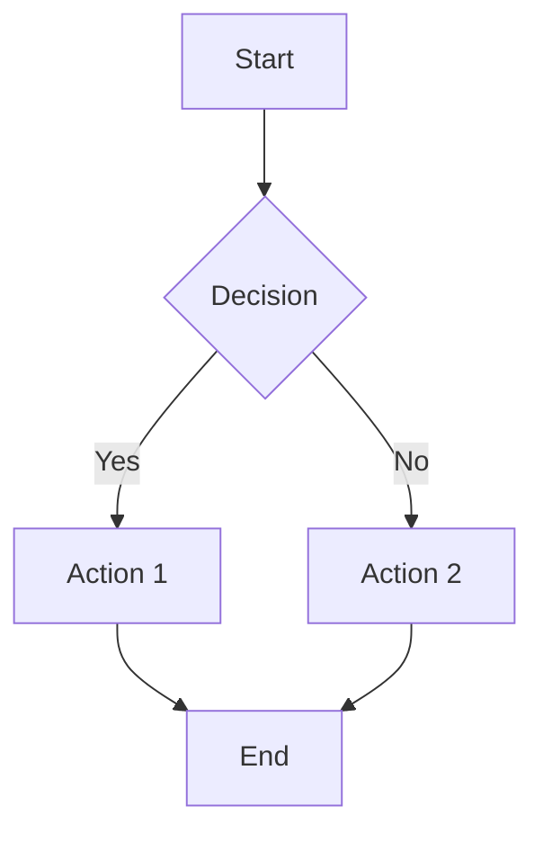
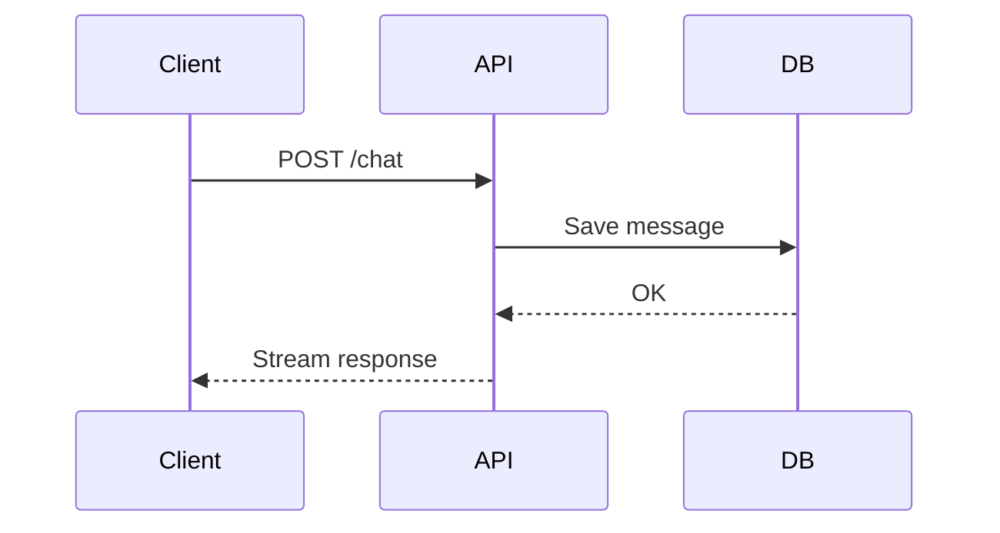
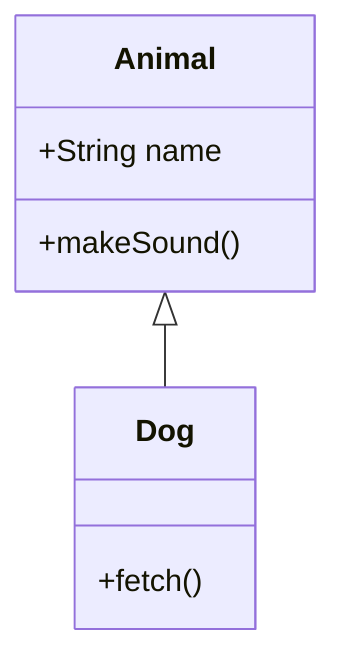
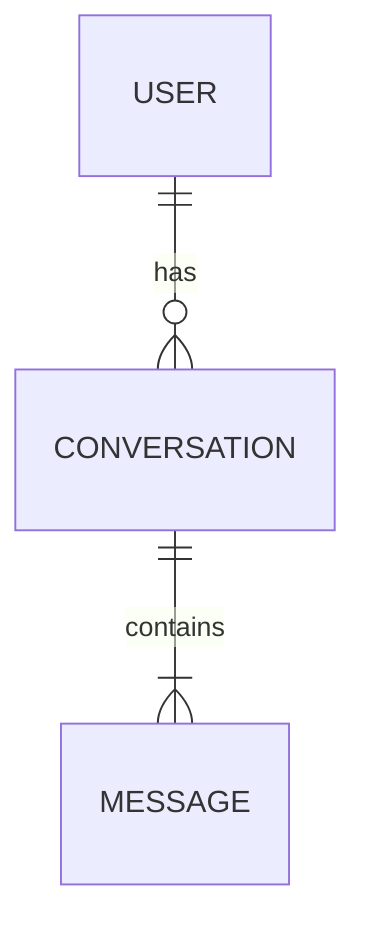

# Generating Mermaid Diagrams

## Workflow

1. Understand what the user wants to visualize
2. Choose the right diagram type (see below)
3. Output valid Mermaid.js syntax in a ```mermaid block
4. Keep diagrams focused — maximum 15-20 nodes

## Diagram Types

### Flowchart (most common)


### Sequence Diagram


### Class Diagram


### Entity Relationship


## Critical Rules

- **Quote node labels with special chars**: `id["Label (with parens)"]`
- **No HTML tags in labels** — they break rendering
- **No special chars in message text**: avoid `:`, `{`, `}`, `;` in sequence messages
- **Max 15-20 nodes** for readable output
- **Always test** that the syntax is valid before presenting

## Mermaid Syntax Gotchas

- Sequence diagram arrows: `->>` (solid), `-->>` (dashed), `-x` (cross)
- Flowchart direction: `TD` (top-down), `LR` (left-right), `RL`, `BT`
- Node shapes: `[]` rectangle, `()` rounded, `{}` diamond, `(())` circle
- Never use `\n` in node labels — use separate nodes instead
